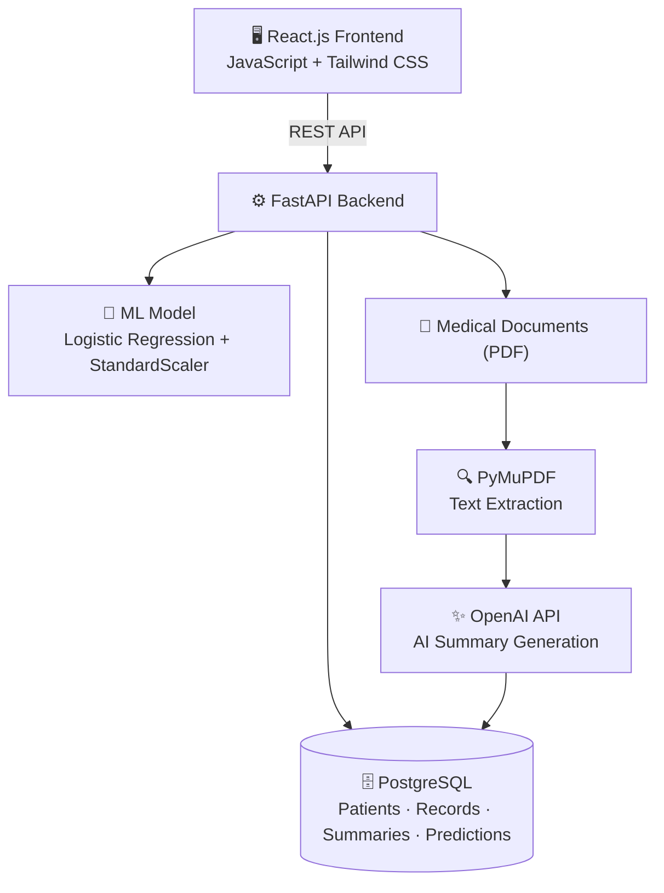
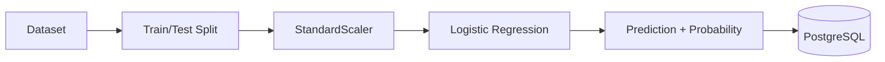
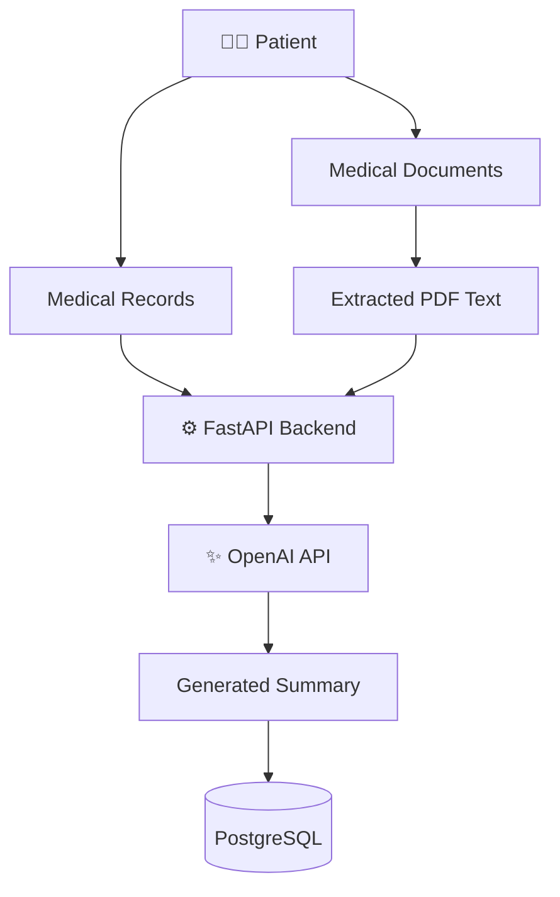
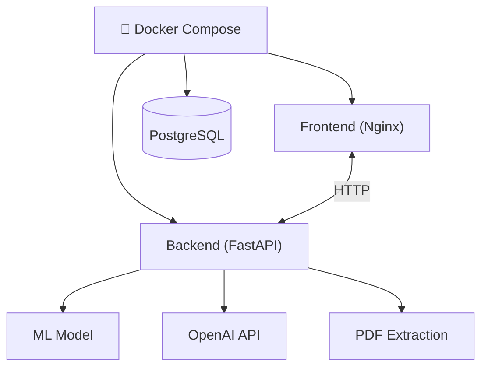
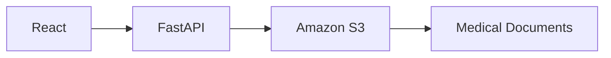

<div align="center">

# 🩺 Medisense

### AI-Powered Medical Record Management System

*A full-stack platform for patient records, document intelligence, and ML-driven health risk prediction.*

[](#)
[](#)
[](#)
[](#)
[](#)
[](#)
[](#)

</div>

---

> ⚠️ **Disclaimer:** Medisense is an **educational and portfolio project**. It is **not** intended for medical diagnosis, treatment recommendations, or clinical decision-making.

---

## 📖 Table of Contents

- [Overview](#-overview)
- [Features](#-features)
- [Tech Stack](#-tech-stack)
- [System Architecture](#-system-architecture)
- [Project Structure](#-project-structure)
- [Database Design](#-database-design)
- [Machine Learning](#-machine-learning)
- [AI Summary Pipeline](#-ai-summary-pipeline)
- [REST API Reference](#-rest-api-reference)
- [Getting Started](#-getting-started)
- [Environment Variables](#-environment-variables)
- [Docker Architecture](#-docker-architecture)
- [AWS Deployment](#-aws-deployment)
- [Security](#-security-considerations)
- [Roadmap](#-roadmap)
- [Project Status](#-project-status)
- [Learning Outcomes](#-learning-outcomes)
- [Author](#-author)

---

## 🌟 Overview

**Medisense** is a full-stack medical record management system that lets users manage patient information, maintain medical records, upload and process medical documents, generate **AI-powered summaries**, and predict **diabetes risk** using a trained Machine Learning model — all wrapped in a modern, containerized, cloud-ready architecture.

---

## ✨ Features

<table>
<tr>
<td width="50%" valign="top">

### 🧑‍⚕️ Patient Management
- Create, view & delete patients
- Auto-generated patient codes
- Centralized patient profile storage

### 📋 Medical Records
- Add records: type, diagnosis, description, date, doctor
- Full patient medical history view
- Delete records

</td>
<td width="50%" valign="top">

### 📄 Medical Documents
- Upload & associate documents with patients
- View / download documents
- Automatic PDF text extraction

### 🤖 AI Medical Summary
- GPT-powered summaries from records + documents
- Persisted in PostgreSQL
- Summarizes — never diagnoses

</td>
</tr>
<tr>
<td width="50%" valign="top">

### 📊 ML Diabetes Prediction
- Logistic Regression model
- StandardScaler feature preprocessing
- Stores prediction + probability history

</td>
<td width="50%" valign="top">

### ☁️ Cloud-Native
- Dockerized microservice architecture
- Deployed with AWS RDS, S3, ECR & ECS
- CI/CD via GitHub Actions (in progress)

</td>
</tr>
</table>

---

## 🛠 Tech Stack

| Layer | Technologies |
|---|---|
| **Frontend** | React.js · JavaScript · Tailwind CSS · Axios · Vite |
| **Backend** | Python · FastAPI · SQLAlchemy · Pydantic · PyMuPDF · OpenAI API · Pandas · Joblib · Scikit-learn |
| **Database** | PostgreSQL |
| **Machine Learning** | Scikit-learn · Logistic Regression · StandardScaler |
| **DevOps** | Docker · Docker Compose · Nginx |
| **Cloud (AWS)** | RDS · S3 · ECR · ECS · Application Load Balancer · GitHub Actions |

---

## 🏗 System Architecture



---

## 📁 Project Structure

```text
Medisense/
├── frontend/
│   ├── src/
│   │   ├── components/
│   │   ├── pages/
│   │   └── services/api.js
│   ├── Dockerfile
│   ├── nginx.conf
│   └── package.json
│
├── backend/
│   ├── app/
│   │   ├── main.py
│   │   ├── database.py
│   │   ├── models.py
│   │   ├── schemas.py
│   │   ├── routes/
│   │   │   ├── patients.py
│   │   │   ├── medical_records.py
│   │   │   ├── medical_documents.py
│   │   │   ├── ai_summary.py
│   │   │   └── prediction.py
│   │   └── services/
│   │       ├── pdf_extractor.py
│   │       ├── ai_summary.py
│   │       └── ml_prediction.py
│   ├── Dockerfile
│   └── requirements.txt
│
├── ml/
│   ├── data/diabetes.csv
│   ├── model/
│   │   ├── diabetes_model.joblib
│   │   └── diabetes_scaler.joblib
│   ├── inspect_data.py
│   └── train.py
│
├── uploads/
├── docker-compose.yml
└── README.md
```

---

## 🗃 Database Design

<details>
<summary><b>🧑‍⚕️ patients</b></summary>

```
id · patient_code · name · age · gender · blood_group
ai_summary · created_at · updated_at
```
</details>

<details>
<summary><b>📋 medical_records</b></summary>

```
id · patient_id · record_type · diagnosis · description
record_date · doctor_name · created_at
```
</details>

<details>
<summary><b>📄 medical_documents</b></summary>

```
id · patient_id · file_name · file_path · file_type
file_size · extracted_text · uploaded_at
```
</details>

<details>
<summary><b>📊 diabetes_predictions</b></summary>

```
id · patient_id · pregnancies · glucose · blood_pressure
skin_thickness · insulin · bmi · diabetes_pedigree_function
age · prediction · probability · created_at
```
</details>

---

## 🧠 Machine Learning

Trained on the **Pima Indians Diabetes Dataset** (768 rows · 8 features · binary target).



**Features:** Pregnancies · Glucose · BloodPressure · SkinThickness · Insulin · BMI · DiabetesPedigreeFunction · Age

**Training Config:** 614 train / 154 test samples · `random_state=42`

| Metric | Score |
|---|---|
| Accuracy | **0.7078** |
| ROC-AUC | **0.8263** |

**Confusion Matrix**

```
[[79, 21],
 [24, 30]]
```

> 📌 Model is for **educational demonstration** only — not clinically validated.

---

## ✨ AI Summary Pipeline



The AI system **summarizes** stored information only. It does **not**:
- ❌ Diagnose diseases
- ❌ Prescribe medication
- ❌ Recommend treatment
- ❌ Replace healthcare professionals

---

## 🔌 REST API Reference

<details>
<summary><b>Patients</b></summary>

```http
GET    /patients/
POST   /patients/
GET    /patients/{patient_id}
DELETE /patients/{patient_id}
```
</details>

<details>
<summary><b>Medical Records</b></summary>

```http
GET    /patients/{patient_id}/medical-records/
POST   /patients/{patient_id}/medical-records/
DELETE /patients/{patient_id}/medical-records/{record_id}
```
</details>

<details>
<summary><b>Medical Documents</b></summary>

```http
GET  /patients/{patient_id}/medical-documents/
POST /patients/{patient_id}/medical-documents/
GET  /patients/{patient_id}/medical-documents/{document_id}/view
GET  /patients/{patient_id}/medical-documents/{document_id}/download
```
</details>

<details>
<summary><b>AI Summary</b></summary>

```http
GET  /patients/{patient_id}/ai-summary
POST /patients/{patient_id}/ai-summary
```
</details>

<details>
<summary><b>ML Prediction</b></summary>

```http
POST /predictions/diabetes
GET  /predictions/patient/{patient_id}
```
</details>

<details>
<summary><b>Health Check</b></summary>

```http
GET /health
```
</details>

---

## 🚀 Getting Started

### Prerequisites
`Node.js` · `Python` · `PostgreSQL` · `Docker Desktop` · `Git`

### ▶️ Run with Docker Compose (Recommended)

```bash
cd Medisense
docker compose up --build
```

| Service | URL |
|---|---|
| Frontend | http://localhost:3000 |
| Backend | http://localhost:8000 |
| Swagger Docs | http://localhost:8000/docs |
| PostgreSQL | localhost:5432 |

```bash
# Stop the application
docker compose down

# Rebuild after code changes
docker compose up --build
```

### 🔧 Run Backend Separately

```bash
cd Medisense/backend
python3 -m venv venv
source venv/bin/activate
pip install -r requirements.txt
uvicorn app.main:app --reload
```
→ Backend: `http://localhost:8000` | Swagger: `http://localhost:8000/docs`

### 🎨 Run Frontend Separately

```bash
cd Medisense/frontend
npm install
npm run dev
```
→ Frontend: `http://localhost:5173`

---

## 🔐 Environment Variables

Create a `.env` file in `backend/`:

```env
DATABASE_URL=postgresql://<username>:<password>@localhost:5432/medisense
OPENAI_API_KEY=<your_openai_api_key>
```

> 🚫 Never commit `.env` or `backend/.env` to GitHub.

---

## 🐳 Docker Architecture



Frontend is built with Node.js and served via Nginx, configured for React SPA routing.

---

## ☁️ AWS Deployment


| Service | Purpose |
|---|---|
| **Amazon RDS** | PostgreSQL database (`ap-south-1` / Mumbai) |
| **Amazon S3** | Medical document storage |
| **Amazon ECR** | Docker image registry |
| **Amazon ECS** | Container deployment |
| **Application Load Balancer** | Traffic routing |
| **GitHub Actions** | CI/CD automation |

**Planned S3 Document Flow:**



---

## 🔒 Security Considerations

- ✅ Never commit `.env` files or expose API keys
- ✅ Keep S3 buckets private
- ✅ Restrict database security-group access
- ✅ Use HTTPS in production
- ✅ Store secrets via environment variables
- ✅ Use IAM roles with least-privilege access
- ✅ Keep the production database private

---

## 🗺 Roadmap

- [ ] Complete Amazon S3 integration
- [ ] Deploy Docker images via Amazon ECR
- [ ] Deploy backend using Amazon ECS
- [ ] Configure Application Load Balancer
- [ ] Deploy frontend to AWS
- [ ] Implement GitHub Actions CI/CD
- [ ] Add HTTPS + custom domain
- [ ] Add automated testing
- [ ] Add database migrations (Alembic)
- [ ] Improve ML evaluation & add more models
- [ ] Add authentication & role-based access control
- [ ] Improve monitoring & logging

---

## 📊 Project Status

| Component | Status |
|---|---|
| React Frontend | ✅ Completed |
| FastAPI Backend | ✅ Completed |
| PostgreSQL | ✅ Completed |
| Patient Management | ✅ Completed |
| Medical Records | ✅ Completed |
| Patient Dashboard | ✅ Completed |
| PDF Upload & Extraction | ✅ Completed |
| AI Medical Summary | ✅ Completed |
| ML Prediction + History | ✅ Completed |
| Dockerization / Compose | ✅ Completed |
| Nginx SPA Routing | ✅ Completed |
| AWS RDS / S3 | ✅ Completed |
| S3 Backend Integration | 🟡 In Progress |
| AWS ECR / ECS | ⏳ Planned |
| Load Balancer | ⏳ Planned |
| Frontend Cloud Deployment | ⏳ Planned |
| GitHub Actions CI/CD | ⏳ Planned |

---

## 🎓 Learning Outcomes

<table>
<tr>
<td valign="top">

**Full-Stack**
- React.js, JS, Tailwind
- REST APIs, Axios
- FastAPI, SQLAlchemy, PostgreSQL

</td>
<td valign="top">

**Machine Learning**
- Preprocessing & scaling
- Logistic Regression
- Model evaluation & serialization

</td>
<td valign="top">

**Generative AI**
- OpenAI API integration
- Structured + unstructured data fusion
- PDF text processing

</td>
</tr>
<tr>
<td valign="top">

**DevOps**
- Docker & Docker Compose
- Nginx
- Containerized architecture

</td>
<td valign="top">

**Cloud**
- Amazon RDS, S3
- Amazon ECR, ECS
- Load Balancer, GitHub Actions

</td>
<td></td>
</tr>
</table>

---

## 👤 Author

**Amit Nishad**
B.Tech Biotechnology · Indian Institute of Technology Hyderabad

*Interests: Software Development · Full-Stack Development · Machine Learning · AI · Cloud Computing · DevOps*

---

<div align="center">

### ⚠️ Disclaimer

Medisense is an **educational and portfolio project**. ML predictions and AI-generated summaries are demonstrations of software/AI integration — **not** medical diagnoses, treatment recommendations, or substitutes for professional medical advice.

</div>